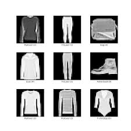

# From Pixels to Patterns: Clustering and Dimensionality Reduction in Image Data Analysis

Ian Wang1      Debal Goswami1      Angelina Ibarra1      Sai Koushik Rao Dugyala1      Prathmesh Thorwe1
 

1Texas A&M University
 

ECEN 758 Data Mining and Analysis Project Fall 2024
 

## Abstract
Understanding and analyzing high-dimensional datasets is a cornerstone in modern data mining and machine learning. In this project, we employed PCA and t-SNE dimensionality reduction techniques to uncover meaningful patterns in Fashion-MNIST, a benchmark for image classification. We investigate the effectiveness of various conventional machine learning models, such as Decision Trees and k-Nearest Neighbors (KNN), together with deep learning architectures like Convolutional Neural Networks (CNN), for classifying fashion items. Variance analysis is the core of our feature extraction pipeline that ensures sound pre-processing to have the best performance out of a chosen model. In this regard, through comparative studies, we can showcase how dimensionality reduction interacts with classification performance for different methods. Our work underlines the considerable effects of reduction in dimensions on computational efficiency and accuracy; it therefore provides practical insights into both classical and neural network-based methods for high-dimensional data tasks. 

## Fashion-MNIST and Sample Data

  

 
We have recently witnessed a rapid evolution in data-driven technologies, including unprecedented advances in machine learning and artificial intelligence, some of which have taken place in image analysis. The current stream of innovation is fueled by newer data sets, such as Fashion-MNIST, its alternative being the classic MNIST dataset. Unlike its predecessor, Fashion-MNIST would be more intricate, focusing on a challenge within classification tasks for gray-scale images of different garments. It thus provides extra complexity and, therefore, is a great benchmark for machine learning and deep learning algorithms. 

## Model: Convolutional Neural Network (CNN)

## Conclusion
In summary, our analysis of the Fashion-MNIST dataset has provided key insights into the performance and applicability of various machine learning and deep learning models in regard to image classification. K-Nearest Neighbors and Decision Trees provided baselines using conventional approaches, whereas the Support Vector Machine stood out for its strong performance in classification among conventional algorithms. While Artificial Neural Networks introduced the benefit of capturing complex data patterns for better accuracy, the classical methods were still lacking. Convolutional Neural Networks, designed for image-based tasks, outperformed all other methods by utilizing their strengths in extracting hierarchical and spatial features. The study has also pointed out the use of PCA and t-SNE dimensionality reduction techniques in enhancing computational efficiency without losing critical data features. Hyperparameter tuning of the CNN model resulted in higher gains, implying that good performance involves iterative optimization of the model. This extensive assessment therefore underlines the importance of making model selection and optimization strategies conform to characteristics in a dataset, hence providing a framework through which high-dimensional image classification challenges can be addressed. These findings not only reinforce the versatility of CNNs but also provide actionable insights for future explorations in data mining and machine learning. 

## Contents
 
<a href="https://www.kaggle.com/datasets/zalando-research/fashionmnist/">Report</a>   

 
<a href="https://www.kaggle.com/datasets/zalando-research/fashionmnist/">Dataset</a> 

Attached here is the report submitted as part of the project, as well as the dataset used for the project which was Fashion-MNIST. 

## References
[1] A. A. Khan, H. Khandelwal, A. Kolekar and S. Lalsingi, "Comparative Analysis of Dimensionality Reduction Techniques," 2024 15th International Conference on Computing Communication and Networking Technologies (ICCCNT), Kamand, India, 2024, pp. 1-6, doi: 10.1109/ICCCNT61001.2024.10724940.
[2] Greeshma KV, Sreekumar K., "Fashion-MNIST classification based on HOG feature descriptor using SVM," January 2019.
[3] H. AlSaeed, N. Hewahi and R. Ksantini, "Dimension Reduction Techniques for Image Classification," 2022 International Conference on Innovation and Intelligence for Informatics, Computing, and Technologies (3ICT), Sakheer, Bahrain, 2022, pp. 358-365, doi: 10.1109/3ICT56508.2022.9990707.
[4] Han Xiao, Kashif Rasul, Rolland Vollgraf, "Fashion-MNIST: A Novel Image Dataset for Benchmarking Machine Learning Algorithms," September 2017.
[5] Hyungkeuk Lee, NamKyung Lee, and Sungjin Lee, "A Method of Deep Learning Model Optimization for Image Classification on Edge Device," September 2022.
[6] Iqbal H. Sarker, "Machine Learning: Algorithms, Real‑World Applications and Research Directions," 2021.
[7] Jagadeesh D. Pujari, Rajesh Yakkundimath, and Abdulmunaf Syedhusain Byadgi, "SVM and ANN-Based Classification of Plant Diseases Using Feature Reduction Technique."
[8] Mingyuan Xin and Yong Wang, "Research on Image Classification Model Based on Deep Convolution Neural Network," 2019.
[9] Olivia Nocentini, Jaeseok Kim, Muhammad Zain Bashir, and Filippo Cavallo, "Image Classification Using Multiple Convolutional Neural Networks on the Fashion-MNIST Dataset," December 2022.
[10] Vandana Kannan, "Feature Selection Using Genetic Algorithms," February 2018.
[11] Yang Li and Xuewei Chao, "ANN-Based Continual Classification in Agriculture," May 2020.
[12] Yansheng Li, Xin Huang, and Hui Liu, "Unsupervised Deep Feature Learning for Urban Village Detection from High-Resolution Remote Sensing Images."
[13] Z. Cheng and Y. Zhang, "A Comparative Analysis of Traditional and CNN-Based Object Recognition Techniques in Robotics," 2024 IEEE 7th Information Technology, Networking, Electronic and Automation Control Conference (ITNEC), Chongqing, China, 2024, pp. 615-620, doi: 10.1109/ITNEC60942.2024.10733076.
